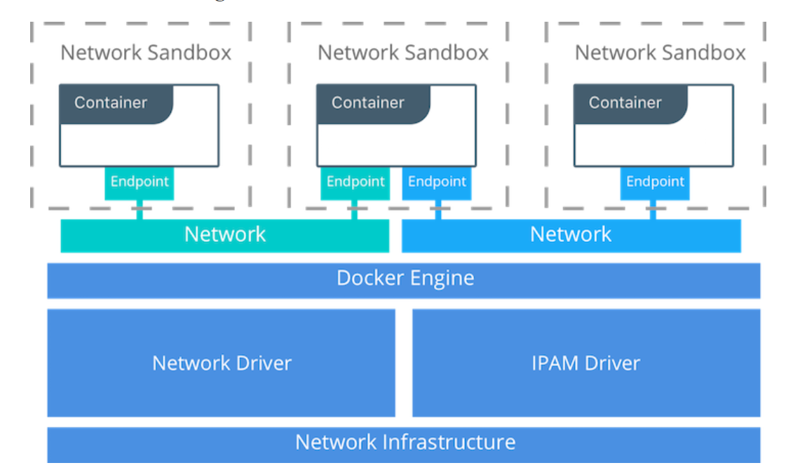
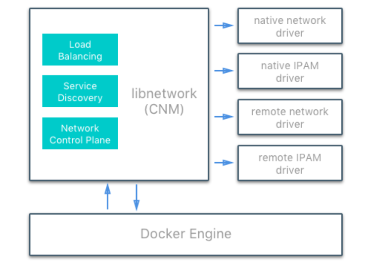
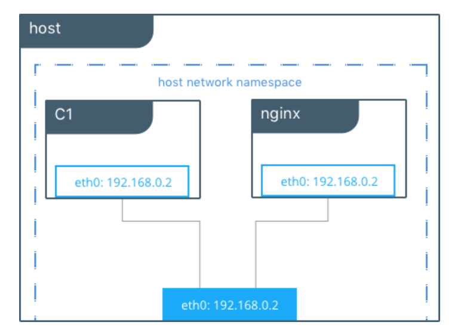
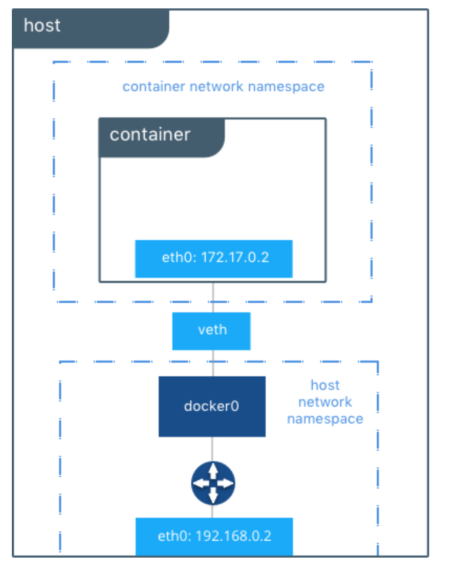
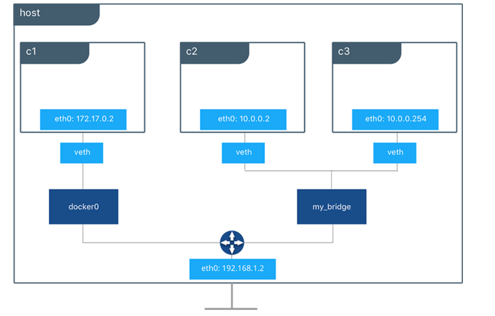

Docker Networking Series – I
----------------------------

### Linux Networking Fundamentals
* Docker networking uses the kernel’s networking stack to create high level networking feature of Docker
* **Docker Networking is Linux Networking**
* Also refer OSI Networking Model over [Refer here](https://en.wikipedia.org/wiki/OSI_model)

#### Building Blocks
### Linux Bridge
* This is layer 2 device with virtual implementation of physical switch inside Linux Kernel
* Forwards the traffic based on MAC address by inspecting traffic.
### Network Namespace
* Isolated network stack in kernel with its own interfaces, routes & firewall rules
### Virtual Ethernet Devices or veth
* Linux networking interface that acts as connecting wire between two two network namespaces
### iptables
* Generic table structure that defines rules & commands as part of the netfilter framework.
### Docker Networking Architecture
* Docker Networking Architecture is based on Container Networking Model.

note: Image from Docker

### CNM Constructs – Sandbox
* Contains the configuration of the containers network stack.
* Includes routing tables, container’s interfaces, DNS setting etc.
* Sample implementation could be Linux Network Namespace or any other similar concept.
### CNM Constructs – Endpoint
* Joins sandbox to the Network.
* This abstracts actual connection to the network away from application.
* Maintains portability for applications, so that they can use different network drivers

### CNM Constructs – Network
* Collection of endpoints having connectivity b/w themselves
### CNM Driver Interfaces
* CNM provides two pluggable & open interfaces to leverage additional functionality and control in the network
   * Network Drivers
   * IPAM Drivers

### Docker Native Network Drivers
* Host
   * Container uses the networking stack of the host.
* Bridge
   * Creates a bridge on the host that is managed by Docker.
   * All containers on Bridge Driver can communicate among themselves
   * Default Driver
* Overlay
   * Used for multi-host networks.
   * uses local linux bridges & VXLAN to overlay container-to-container networking
* MACVLAN
   * uses Linux MACVLAN bridge to establish connection b/w container interfaces & parent host interfaces
   * MAC address can be attached to each container
* None

### Docker Networking Scopes
* Local: provides connectivity within host
* Swarm: provides connectivity across swarm cluster

### Tutorials
* [Bridge](https://docs.docker.com/network/network-tutorial-standalone/)
* [Host](https://docs.docker.com/network/network-tutorial-host/)
* [Overlay](https://docs.docker.com/network/network-tutorial-overlay/)

### Host Network Driver
* In host network driver all the containers are in same network namespace(sandbox)

**Bridge Network Driver**

**Default Bridge Network Driver**

User-Defined Bridge Networks

note: All the images are picked from Docker Documentations

